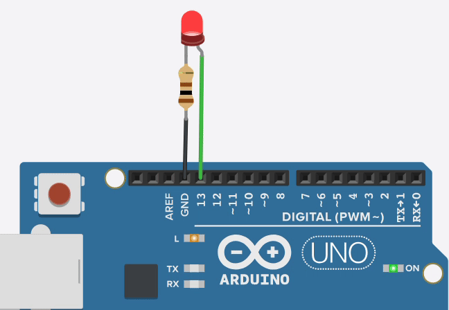
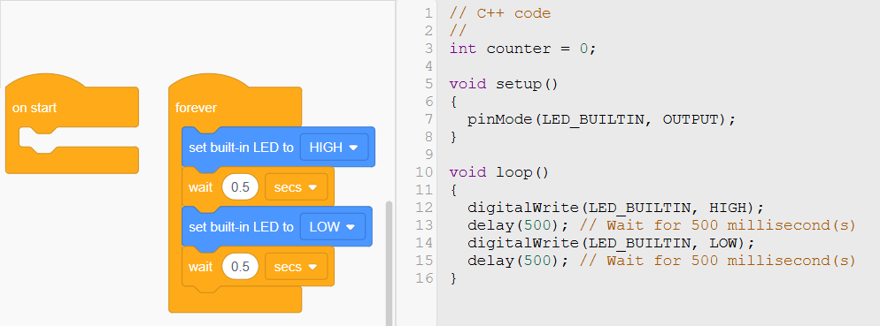

# Introduction to Block Programming

## Explanation of Block Programming and Its Purpose

Block programming, also known as block-based coding, is a visual programming approach where users create programs by dragging and dropping pre-defined blocks of code instead of writing text-based syntax. Each block represents a specific command, function, or logic structure, and these blocks can be snapped together like puzzle pieces to form a complete program. The primary purpose of block programming is to simplify the coding process, making it accessible to beginners, especially those with little to no prior programming experience. By eliminating the need to memorize complex syntax and reducing the risk of typographical errors, block programming allows users to focus on understanding programming logic and problem-solving concepts.

In platforms like Tinkercad Circuits, block programming serves as an entry point to coding hardware such as Arduino microcontrollers. It bridges the gap between visual design and text-based programming by generating equivalent Arduino code in real-time as blocks are assembled. This dual representation helps users learn how high-level concepts translate into executable code, fostering a deeper understanding of programming principles while encouraging creativity and experimentation.

## Overview of Its Uses in Education and Programming

Block programming is widely used in educational settings and introductory programming environments due to its intuitive nature. In education, it is a powerful tool for teaching students of all ages the fundamentals of computational thinking, including sequencing, conditionals, loops, and variables. Tools like Tinkercad Circuits leverage block programming to introduce students to electronics and microcontroller programming, enabling them to simulate and test circuits virtually before building them physically. This hands-on approach enhances engagement and retention of STEM (Science, Technology, Engineering, and Math) concepts.

Beyond education, block programming is also used in prototyping and hobbyist projects. It allows users to quickly iterate on ideas without getting bogged down in syntax details, making it ideal for rapid development and experimentation. In Tinkercad Circuits, for instance, block programming empowers users to control hardware components like LEDs, sensors, and motors, providing a practical introduction to embedded systems programming that can later transition to more advanced text-based environments like the Arduino IDE.

## Detailed Explanation of Block Types in Tinkercad Circuits

Tinkercad Circuits uses a block-based programming interface powered by Scratch Blocks to program Arduino microcontrollers. Below is a detailed breakdown of the various block categories available, their functions, purposes, and examples of how and when to use them.

### 1. Output Blocks (Action Blocks)

- **Description**: Output blocks are used to send commands to hardware components, such as turning on an LED or activating a motor. In Tinkercad Circuits, these blocks control digital or analog outputs on the Arduino.
- **Function and Purpose**: They allow users to specify actions for specific pins, such as setting a pin to HIGH (on) or LOW (off) for digital outputs or setting a value for analog outputs (e.g., PWM for dimming an LED). These blocks automatically generate the necessary setup code (e.g., `pinMode`) in the background.
- **Example**: The "set pin [13] to [HIGH]" block turns on the built-in LED connected to pin 13 of an Arduino Uno.
- **When to Use**: Use output blocks when you need to control a physical component, such as blinking an LED or starting a servo motor. For instance, in a simple LED blink project, you would use one output block to set pin 13 to HIGH and another to set it to LOW, alternating between them with delays.

### 2. Control Blocks

- **Description**: Control blocks manage the flow of a program, dictating when and how often actions occur. In Tinkercad Circuits, these include delay blocks and other timing-related commands.
- **Function and Purpose**: They introduce pauses or timing intervals in the program, ensuring actions happen in the desired sequence or rhythm. The "wait [1] secs" block, for example, pauses execution for a specified duration.
- **Example**: In an LED blink circuit, a "wait 1 secs" block is placed between "set pin 13 to HIGH" and "set pin 13 to LOW" to keep the LED on for one second before turning it off.
- **When to Use**: Use control blocks to add timing to your program, such as creating a blinking pattern or spacing out sensor readings. They are essential for any project requiring precise timing.

### 3. Logic Blocks

- **Description**: Logic blocks handle conditional statements and decision-making, allowing the program to respond differently based on specific conditions. In Tinkercad Circuits, these include "if" and "if-else" blocks.
- **Function and Purpose**: They evaluate conditions (e.g., sensor values or button states) and execute code only if the condition is true. This enables dynamic responses in a program.
- **Example**: An "if [digital read pin 2] = [HIGH]" block could check if a button on pin 2 is pressed, then turn on an LED if true.
- **When to Use**: Use logic blocks when your program needs to make decisions, such as turning on a buzzer only when a sensor detects a certain value or stopping a motor when a limit switch is triggered.

### 4. Loops

- **Description**: Loop blocks repeat a set of actions multiple times, either indefinitely or for a specified number of iterations. Tinkercad Circuits automatically places all blocks within the Arduino `loop()` function, which runs continuously, but additional loop blocks like "repeat [10] times" can be nested inside.
- **Function and Purpose**: They reduce redundancy by allowing a sequence of commands to repeat without manually duplicating blocks. This is key for tasks requiring repetition.
- **Example**: A "repeat 5 times" block containing "set pin 13 to HIGH," "wait 0.5 secs," "set pin 13 to LOW," and "wait 0.5 secs" will blink an LED five times.
- **When to Use**: Use loops for repetitive tasks, such as flashing an LED a set number of times or polling a sensor periodically. They’re ideal for patterns or automation.

### 5. Variables

- **Description**: Variable blocks allow users to store and manipulate data, such as numbers or sensor readings. In Tinkercad Circuits, these are typically used with input blocks or math operations.
- **Function and Purpose**: They enable dynamic programming by storing values that can change during execution, such as a counter or a sensor reading, and allow those values to influence other blocks.
- **Example**: A "set [counter] to [0]" block followed by a "change [counter] by [1]" inside a loop can count iterations. You could then use an "if [counter] = [5]" block to stop an action after five loops.
- **When to Use**: Use variables when you need to track or modify data, such as counting button presses, averaging sensor readings, or creating a fading LED effect with analog output.

### 6. Input Blocks (Sensor Blocks)

- **Description**: Input blocks read data from sensors or pins, such as buttons, potentiometers, or light sensors. In Tinkercad Circuits, these include "digital read" and "analog read" blocks.
- **Function and Purpose**: They retrieve real-time information from the circuit, enabling the program to respond to external conditions. The data can be used in logic blocks or stored in variables.
- **Example**: An "analog read [A0]" block reads the value (0–1023) from a potentiometer on pin A0, which could then adjust the brightness of an LED using an "analog write" output block.
- **When to Use**: Use input blocks when your project interacts with the environment, such as dimming an LED based on a light sensor or activating a motor when a button is pressed.

## Exploration of Output Blocks in Tinkercad Circuits Block Programming

Output blocks are a fundamental category in block-based programming environments like Tinkercad Circuits. They serve as the bridge between the digital instructions of a program and the physical actions of hardware components, such as LEDs, buzzers, motors, or other output devices connected to an Arduino microcontroller. This exploration dives into the specifics of output blocks in Tinkercad Circuits, their functionality, purposes, variations, and practical applications, providing a comprehensive understanding of how they work and how to use them effectively.

### What Are Output Blocks?

Output blocks in Tinkercad Circuits are visual code elements that allow users to send commands to the pins of an Arduino, controlling attached hardware. These blocks are part of the "Output" category in the Tinkercad programming interface and are designed to simplify the process of interacting with physical components. When you place an output block in your program, Tinkercad automatically generates the equivalent Arduino code (e.g., `digitalWrite()` or `analogWrite()`), including necessary setup commands like `pinMode()`, which are hidden from the user to keep the focus on logic rather than syntax.

Output blocks come in two primary forms: **digital output blocks** and **analog output blocks**. Each type serves a distinct purpose based on the kind of signal it sends to the hardware.

### Detailed Description of Output Block Types

#### 1. Digital Output Blocks

- **Function and Purpose**: Digital output blocks control pins by setting them to one of two states: HIGH (typically 5V on an Arduino Uno) or LOW (0V). This binary control is ideal for components that operate in an on/off manner, such as LEDs, relays, or simple buzzers.
- **Appearance in Tinkercad**: The block is labeled "set pin [number] to [HIGH/LOW]" with dropdown menus to select the pin number and state.
- **How It Works**: When executed, the block sends a HIGH or LOW signal to the specified pin. For example, setting pin 13 to HIGH turns on the built-in LED on an Arduino Uno, while setting it to LOW turns it off.
- **Generated Code**: Behind the scenes, this block translates to `digitalWrite(pin, value);` in Arduino C++. For instance, "set pin 13 to HIGH" becomes `digitalWrite(13, HIGH);`. Additionally, if not already defined, Tinkercad inserts `pinMode(pin, OUTPUT);` in the `setup()` function automatically.
- **Example Use Case**: Blinking an LED.
  - **Blocks**:

    
  - **Result**: The LED on pin 13 blinks on and off every second when placed inside the default `loop()` structure.
  
- **When to Use**: Use digital output blocks for simple on/off control of components, such as lighting an LED, activating a relay to switch a circuit, or triggering a buzzer to beep.

#### 2. Analog Output Blocks

- **Function and Purpose**: Analog output blocks allow for variable control of a pin’s output using Pulse Width Modulation (PWM), which simulates an analog signal by rapidly switching a digital pin on and off. This is useful for components that support gradual changes, like dimming LEDs or controlling motor speed.
- **Appearance in Tinkercad**: The block is labeled "set pin [number] to [value]" with a dropdown for the pin and a field to input a value between 0 and 255 (representing 0% to 100% duty cycle).
- **How It Works**: The block adjusts the PWM signal on a compatible pin (e.g., pins 3, 5, 6, 9, 10, or 11 on an Arduino Uno in Tinkercad). A value of 0 is fully off, 255 is fully on, and values in between produce intermediate levels.
- **Generated Code**: This translates to `analogWrite(pin, value);`. For example, "set pin 9 to 128" becomes `analogWrite(9, 128);`, setting the pin to approximately 50% brightness.
- **Example Use Case**: Fading an LED.
  - **Blocks**:
  
  - **Result**: The LED on pin 9 gradually brightens from off to full brightness over a few seconds.
  
- **When to Use**: Use analog output blocks for tasks requiring smooth transitions, such as dimming lights, adjusting motor speeds, or controlling the volume of a piezo buzzer (if PWM-compatible).
## Exploration of Special Output Blocks in Tinkercad Circuits Block Programming

Special output blocks in Tinkercad Circuits are a subset of output blocks designed to simplify common tasks or interact with specific hardware features, such as the built-in LED on an Arduino Uno. These blocks often abstract away some of the lower-level details (like pin numbers) to make programming more intuitive for beginners. This section explores the "set built-in LED to" block as a starting point, detailing its functionality, purpose, and use cases, with examples to illustrate its application.

### What Are Special Output Blocks?

Special output blocks differ from general output blocks (e.g., "set pin [number] to [HIGH/LOW]") by targeting specific hardware features or simplifying common operations. In Tinkercad Circuits, these blocks are part of the "Output" category but are tailored for ease of use, often pre-configuring settings like pin assignments. The "set built-in LED to" block, for instance, directly controls the Arduino Uno’s built-in LED on pin 13 without requiring the user to specify the pin number explicitly.

### Detailed Description of Special Output Block Types

#### 1. Set Built-in LED to Block

- **Function and Purpose**: The "set built-in LED to" block controls the Arduino Uno’s built-in LED, which is hardwired to digital pin 13. It sets the LED to either ON (HIGH) or OFF (LOW), providing a beginner-friendly way to experiment with output without needing to connect external components or specify pin numbers. This block is ideal for initial explorations of digital output concepts.
- **Appearance in Tinkercad**: The block is labeled "set built-in LED to [ON/OFF]" with a dropdown menu to select the state (ON or OFF). Unlike general output blocks, it does not include a pin number field, as it is fixed to pin 13.
  
  

- **How It Works**: When executed, the block sends a HIGH (5V) or LOW (0V) signal to pin 13, turning the built-in LED on or off, respectively. Tinkercad automatically configures pin 13 as an OUTPUT, so no separate `pinMode` setup is required, further simplifying the process for beginners.
- **Generated Code**: This block translates to Arduino C++ as follows:
  ```cpp
  digitalWrite(LED_BUILDIN, HIGH);  // For "set built-in LED to ON"
  digitalWrite(LED_BUILDIN, LOW);   // For "set built-in LED to OFF"
  ```
  

#### 2. Print to Serial Monitor Block

- **Function and Purpose**: The "print to Serial Monitor" block sends text, numbers, or variable values to the Tinkercad Serial Monitor, a virtual display that shows output from the Arduino. This block is ideal for debugging programs, displaying sensor readings, or providing feedback during execution. It’s a key tool for understanding how a program behaves over time.
- **Appearance in Tinkercad**: The block is labeled "print to Serial Monitor [text/variable]" with an input field where users can type a message (e.g., "Hello") or insert a variable block. It also has an optional dropdown to choose "print" (no newline) or "println" (with a newline), though Tinkercad often defaults to "println" for simplicity.

  

- **How It Works**: When executed, the block sends the specified data to the Serial Monitor via the Arduino’s serial communication.The specified data can either be a text or a variable. Tinkercad automatically initializes the Serial library with a baud rate (typically 9600) in the background, so no manual setup (e.g., `Serial.begin()`) is required. The output appears in the Serial Monitor window when the simulation runs.
- **Generated Code**: This block translates to Arduino C++ as follows:
  ```cpp
  Serial.println("Hello");  // For "print to Serial Monitor Hello" with println
  Serial.print("Hello");    // For "print to Serial Monitor Hello" without newline
  ```
- **Example Usage**:

#### 3. Set RGB LED in Pins Block

- **Function and Purpose**: The "set RGB LED in pins" block controls a common-cathode or common-anode RGB LED by setting the intensity of its red, green, and blue channels via three PWM-capable pins. It uses Pulse Width Modulation (PWM) to mix colors, making it ideal for creating dynamic lighting effects, teaching analog output, or prototyping visual displays.
- **Appearance in Tinkercad**: The block is labeled "set RGB LED in pins [R] [G] [B] to [color/value]" with three dropdown menus to select the pins for red, green, and blue (e.g., 11, 10, 9), and an input field to choose a color (via a color picker) or a numerical value (0–255) for each channel. In Tinkercad, it assumes a common-cathode RGB LED by default.

  

- **How It Works**: When executed, the block sends PWM signals to the specified pins, adjusting the brightness of each RGB LED channel. Values range from 0 (off) to 255 (full brightness). Tinkercad automatically configures the selected pins as OUTPUT and initializes PWM support, so no additional setup is needed. For a common-cathode RGB LED, the cathode is wired to ground, and the red, green, and blue anodes connect to PWM pins through resistors.
- **Generated Code**: This block translates to Arduino C++ as follows:
  ```cpp
  analogWrite(11, 255);  // Red pin 11 to full brightness
  analogWrite(10, 0);    // Green pin 10 off
  analogWrite(9, 0);     // Blue pin 9 off
  ```
- **Example Usage**:

### Tips for Using Output Blocks Effectively

- **Pin Selection**: Ensure the correct pin is chosen. Only PWM-capable pins (marked with a "~" on the Arduino, like 3, 5, 6, 9, 10, 11) support analog output blocks.
- **Timing**: Pair output blocks with control blocks (e.g., "wait") to create sequences or patterns, as outputs execute instantly without delays unless specified.
- **Component Compatibility**: Verify that the hardware matches the block type—digital outputs won’t dim an LED, and analog outputs won’t work on non-PWM pins.
- **Simulation**: Use Tinkercad’s simulator to test outputs virtually before building physically, ensuring the logic works as intended.

### Why Output Blocks Matter

Output blocks are the action-oriented heart of block programming in Tinkercad Circuits. They empower users to bring their circuits to life, translating abstract logic into tangible results. Whether turning on a single LED or orchestrating a symphony of lights and sounds, output blocks provide the essential link between code and the physical world. For beginners, they demystify hardware control, while for advanced learners, they lay the groundwork for understanding more complex programming concepts in text-based environments.

By mastering output blocks, users unlock endless possibilities for creativity and experimentation, making them a cornerstone of any Tinkercad Circuits project.

## Exploration of Input Blocks in Tinkercad Circuits Block Programming

Input blocks in Tinkercad Circuits enable programs to read data from external components, such as buttons, potentiometers, or sensors, connected to the Arduino’s pins. These blocks are essential for creating interactive projects that respond to real-world conditions. This section explores the two primary input blocks—digital read and analog read—detailing their functionality, purposes, and practical applications in the context of Tinkercad’s block-based programming environment.

### What Are Input Blocks?

Input blocks are visual code elements in Tinkercad Circuits that retrieve data from the Arduino’s digital or analog pins. Found in the "Input" category of the programming interface, they allow users to capture binary states (e.g., HIGH/LOW) or variable values (e.g., 0–1023) from components like switches, sensors, or potentiometers. By integrating these inputs into logic, loops, or output blocks, users can build dynamic systems that adapt to environmental changes, fostering interactivity and real-time responsiveness.

### Detailed Description of Input Block Types

#### 1. Digital Read Block

- **Function and Purpose**: The "digital read" block reads the state of a digital pin, returning either HIGH (5V) or LOW (0V). It’s ideal for components with binary outputs, such as pushbuttons, switches, or digital sensors (e.g., a tilt sensor), enabling the program to detect on/off conditions.
- **Appearance in Tinkercad**: The block is labeled "digital read pin [number]" with a dropdown menu to select the pin (e.g., 2, 3, etc.). It outputs a HIGH or LOW value that can be used in logic blocks or variables.
  


- **How It Works**: When executed, the block checks the voltage on the specified pin. If the pin is connected to a component like a button with a pull-down resistor, pressing the button sends 5V (HIGH); releasing it sends 0V (LOW). Tinkercad automatically configures the pin as INPUT when the block is used, simplifying setup for beginners.
- **Generated Code**: This block translates to Arduino C++ as:
  ```cpp
  digitalRead(2);  // Reads state of pin 2
  ```
  Tinkercad adds `pinMode(2, INPUT);` to the `setup()` function automatically if not explicitly defined.
- **Example Use Case**: Button Press Detection.
  - **Blocks**:
  
    
  - **Result**: The built-in LED on pin 13 lights up when a button on pin 2 is pressed and turns off when released.
- **When to Use**: Use this block for projects involving binary inputs, such as detecting button presses, switch toggles, or digital sensor triggers (e.g., a motion sensor outputting HIGH when activated).

#### 2. Analog Read Block

- **Function and Purpose**: The "analog read" block reads the voltage on an analog pin, returning a value between 0 and 1023 corresponding to 0V to 5V. It’s designed for components with variable outputs, like potentiometers, light sensors, or temperature sensors, allowing programs to respond to continuous data.
- **Appearance in Tinkercad**: The block is labeled "analog read [pin]" with a dropdown to select an analog pin (e.g., A0, A1, etc.). It outputs a numerical value that can be stored in variables or used in calculations.


- **How It Works**: The block uses the Arduino’s Analog-to-Digital Converter (ADC) to measure the voltage on the specified pin, mapping it to a 10-bit range (0–1023). For example, a potentiometer halfway turned might output ~512. `pinMode`  for analog pins in Tinkercad, is automatically set for input.
- **Generated Code**: This block translates to Arduino C++ as:
  ```cpp
  analogRead(A0);  // Reads voltage on pin A0
  ```
- **Example Use Case**: LDR controlled LED
  - **Blocks**:
  
  - **Result**: An LED on pin 9 (PWM-capable) dims or brightens based on the light detected by photoresistor.
- **When to Use**: Use this block for projects requiring variable inputs, such as adjusting outputs based on light levels, temperature, or user-controlled dials.

---


### Tips for Using Input Blocks Effectively

- **Pin Selection**: Use digital pins (e.g., 2–13) for digital read blocks and analog pins (e.g., A0–A5) for analog read blocks to match component types.
- **Pull-Down Resistors**: For digital inputs like buttons, add a pull-down resistor (e.g., 10kΩ to ground) to ensure stable LOW readings when not pressed.
- **Scaling**: For analog inputs driving PWM outputs (0–255), divide the analog read value by 4 (e.g., `analog read A0 / 4`) to map correctly.
- **Simulation**: Test inputs in Tinkercad’s simulator by interacting with virtual components (e.g., sliding a potentiometer) to verify readings.
- **Debouncing**: For buttons, add short delays (e.g., "wait 0.05 secs") in loops to avoid multiple triggers from a single press.

---

### Why Input Blocks Matter

Input blocks are the gateway to interactivity in Tinkercad Circuits, transforming static programs into responsive systems. The digital read block empowers users to work with binary logic, while the analog read block unlocks continuous data, enabling projects from simple switches to complex sensor-driven designs. For beginners, these blocks demystify hardware inputs; for educators, they provide a platform to teach real-world applications of programming. By mastering input blocks, users gain skills that translate to text-based Arduino coding with `digitalRead()` and `analogRead()`, building a foundation for advanced embedded systems.